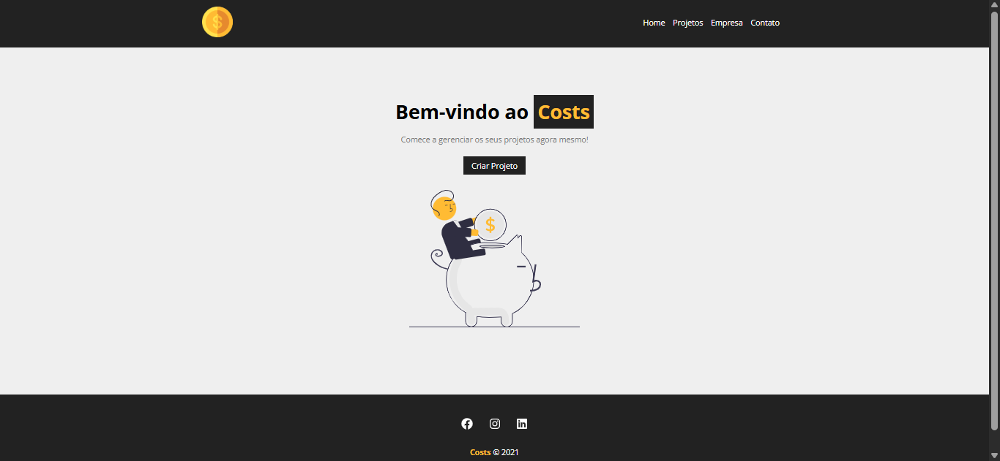

# 🪙 Costs
​
Bem-vindo ao **Costs**!

O **Costs** é um projeto desenvolvido com base no conteúdo do canal **Matheus Battisti – Hora de Codar**, no qual o professor disponibiliza um curso introdutório de **React.js**.  
A proposta do curso é apresentar os principais conceitos da biblioteca por meio da construção prática da aplicação **Costs**, focada na organização e no controle de projetos e custos.

## Layout

    

## 📋 Features

- **Design Responsivo:** Adapta-se a diferentes tamanhos de tela, garantindo uma boa experiência em dispositivos móveis e computadores.

- **Navegação Fluida:** Links de navegação que levam a seções específicas da página para facilitar a usabilidade.

## 🛠️ Technologies Used

